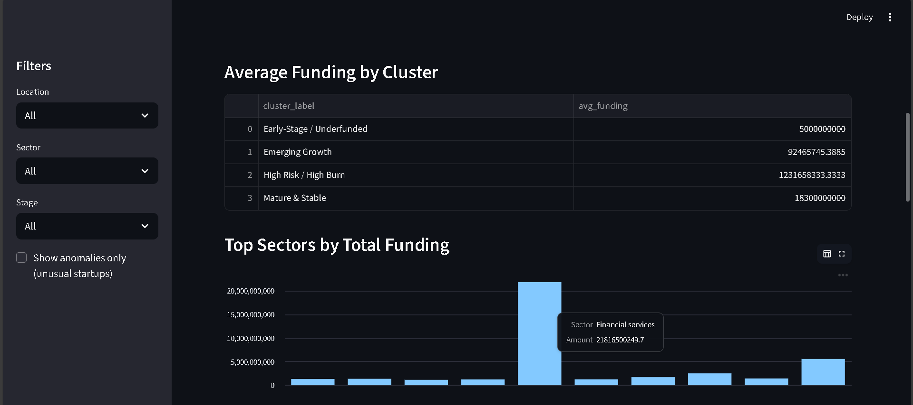
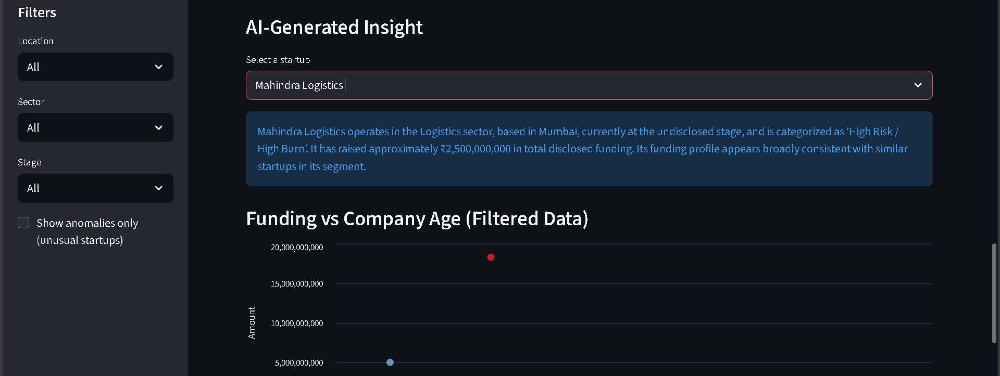

# AI Market Intelligence Platform

An AI-driven market intelligence and opportunity discovery platform for Indian startups using machine learning and an interactive Streamlit dashboard.

---

## 🔍 Problem
Investors and analysts often struggle to identify promising startup sectors, funding patterns, and unusual companies from raw funding data.

---

## 💡 Solution
This project builds an end-to-end AI system that:
- Cleans and processes Indian startup funding data
- Engineers business features such as company age and log funding
- Applies clustering, regression, and anomaly detection models
- Presents insights through an interactive Streamlit dashboard

---

## 🛠 Tech Stack
- Python
- Pandas, NumPy
- Scikit-learn
- Streamlit

---

## 📊 Dashboard Preview

### Overall Dashboard


### Market Segmentation & Sector Analysis


### AI-Generated Insight


---

## 🚀 How to Run (Local)

```bash
pip install -r requirements.txt
python run_pipeline.py
streamlit run app.py
